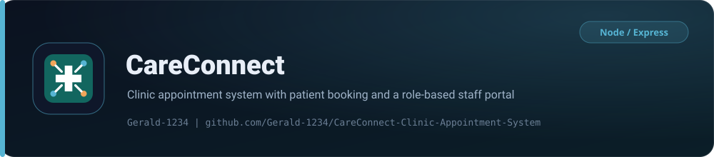

<p align="center">
  <picture>
    
  </picture>
</p>

<p align="center">
  <strong>A role-based clinic appointment system with patient self-service and a staff portal.</strong>
</p>

<p align="center">
  
  
  
</p>
<p align="center">
  
  
  
</p>
<p align="center">
  
  
  
</p>

The frontend uses HTML, CSS and vanilla JavaScript, while the backend uses Node.js and Express. Controllers use direct Supabase queries, validation is kept in small helper functions, and every major module has a clear responsibility. The Supabase secret key is used only by the backend.

## Main features

| Area | Capability |
| --- | --- |
| Dashboard | Responsive, role-based clinic dashboard |
| Patients | Patient registration and profile management |
| Auth | Staff and patient login with JWT authentication and login lockout |
| Roles | Six roles: patient, receptionist, doctor, nurse, manager and admin |
| Scheduling | Doctor weekly availability and available-slot generation |
| Appointments | Booking, rescheduling, cancellation and status updates with double-booking checks for both doctors and patients |
| Clinical | Nurse vital-sign entry, doctor consultation and medical-history records |
| Notifications | In-app appointment confirmations and reminders |
| Reports | Attendance and doctor-utilization reports with CSV export |
| Administration | Staff-account administration and audit logs |

The system does not handle billing, insurance, pharmacy inventory, laboratory management or payroll, because those items are outside the project scope.

## Technology

| Layer | Choice |
| --- | --- |
| Frontend | HTML5, CSS3, vanilla JavaScript (ES modules), hash-routed dashboard |
| Backend | Node.js 20+, Express 5 |
| Database | Supabase PostgreSQL, service-key client, RLS enabled without browser policies |
| Auth | JWT (HS256), bcryptjs password hashing, failed-login lockout |
| Security | Helmet, CORS allow-list, compression, `express-rate-limit`, Cloudflare security headers |
| Tests | Node built-in `node:test` |
| Hosting | Render (backend), Cloudflare Workers static assets (frontend) |

## Project structure

```text
client/
  index.html                  Login and patient registration
  dashboard.html              Role-based clinic portal
  _headers                    Cloudflare security and CSP headers
  assets/                     CSS, JavaScript modules and visual assets
  README.md                   Frontend setup and defence guide
database/
  schema.sql                  Supabase database tables
server/
  server.js                   Starts the HTTP server
  src/
    app.js                    Express middleware and route registration
    config/                   Supabase connection
    controllers/              Application logic
    middleware/               Authentication and role checks
    routes/                   API route definitions
    scripts/                  Admin setup script
    utils/                    Small shared helper functions
  test/                       Unit tests
DEVELOPERS.md                 Frontend integration and API contract
render.yaml                   Render deployment blueprint (backend)
wrangler.toml                 Cloudflare static-assets configuration (frontend)
LICENSE                       MIT license
```

## Local setup

### 1. Create the database

1. Create a Supabase project.
2. Open the Supabase SQL Editor and run the full contents of `database/schema.sql`.
3. Copy the project URL and backend secret key from the Supabase project settings.

The secret key must only be used by the Express backend. Never put it in frontend JavaScript.

### 2. Configure the backend

```bash
cd server
npm install
```

Create `server/.env` from `server/.env.example`, then enter the real values:

```env
SUPABASE_URL=https://your-project.supabase.co
SUPABASE_SECRET_KEY=your-secret-key
JWT_SECRET=a-long-random-value-with-at-least-32-characters
CLIENT_URL=http://localhost:5500
```

### 3. Create the first administrator

Set the `ADMIN_*` values in `server/.env`, then run:

```bash
npm run create-admin
```

The administrator can create receptionist, doctor, nurse, manager and additional admin accounts through `POST /api/admin/users`.

### 4. Start the backend

```bash
npm run dev     # development, watch mode
npm start       # normal mode
```

The default local address is `http://localhost:5000` with a health check at `GET http://localhost:5000/api/health`.

### 5. Start the frontend

```bash
cd client
python -m http.server 5500
```

Then open `http://localhost:5500`. The backend `CLIENT_URL` must contain `http://localhost:5500`.

## Default admin credentials

`npm run create-admin` creates the administrator account below so the system can be accessed right after setup:

| Role | Email | Password |
| --- | --- | --- |
| Administrator | `admin@careconnect.local` | `Encrypted.01` |

These are demo credentials for trying the app. Change the `ADMIN_*` values in `server/.env` before any real deployment.

## Tests

```bash
npm test
```

The tests cover password and date helpers, appointment overlap detection, doctor schedule checks and available-slot generation.

## Backend deployment on Render

The repository includes `render.yaml`.

1. Push the repository to GitHub.
2. Create a Render Blueprint from the repository.
3. Enter `SUPABASE_URL`, `SUPABASE_SECRET_KEY` and `CLIENT_URL` when Render asks.
4. Allow Render to generate `JWT_SECRET`.
5. Deploy the web service.

The blueprint uses `server/` as the root directory, installs production dependencies, starts the API with `npm start` and checks `/api/health`.

Run `database/schema.sql` in Supabase before the first deployment. You can create the first administrator locally because the local script and the deployed API use the same Supabase database.

## Frontend deployment on Cloudflare

`wrangler.toml` publishes the `client/` folder as a static-assets Worker named `ccas-website`:

```bash
npx wrangler deploy
```

Alternatively, connect the repository to a Cloudflare Pages project and set the output directory to `client`.

The production API address is stored in `client/assets/js/config.js`. Set the backend `CLIENT_URL` to the exact deployed frontend origin. If the Render backend address changes, update both `config.js` and the `connect-src` rule in `client/_headers`.

## Authentication

Successful registration and login return a JWT:

```json
{
  "token": "jwt-value",
  "user": {
    "id": "user-uuid",
    "role": "patient"
  }
}
```

Protected requests must include:

```http
Authorization: Bearer jwt-value
```

See [`DEVELOPERS.md`](DEVELOPERS.md) for the complete route list and frontend examples.

## Design notes

- The frontend uses one dashboard and changes navigation according to the user role.
- All API calls pass through one reusable `apiRequest()` function.
- The JWT is kept in `sessionStorage` and sent in the Authorization header.
- Frontend role checks improve usability; Express middleware provides security.
- Passwords are hashed with bcrypt before storage.
- JWT middleware identifies the logged-in user, and role middleware blocks routes outside a user's duties.
- Appointment conflict checks compare start and end times for both the doctor and the patient.
- A doctor can only write the record for an appointment assigned to that doctor.
- A nurse can record vital signs but cannot write a diagnosis.
- Cancelled appointments remain in the database for reporting and auditing.
- Supabase Row Level Security is enabled without browser policies, so the frontend must use the Express API.

## License

Released under the [MIT License](LICENSE).

<p align="center"><sub>Built and maintained by <a href="https://github.com/gerald-1234">Gerald-1234</a></sub></p>
